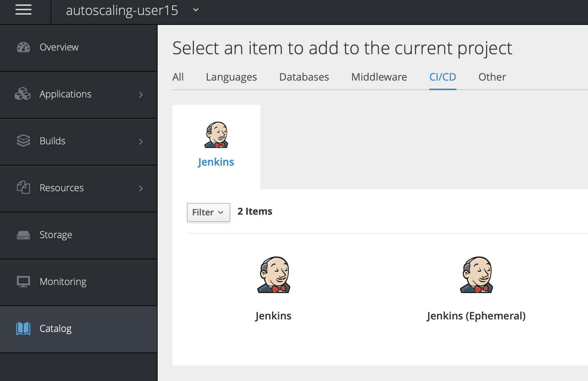
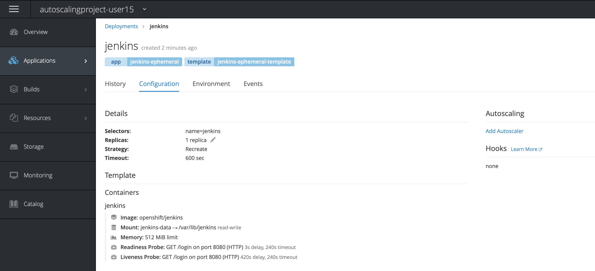
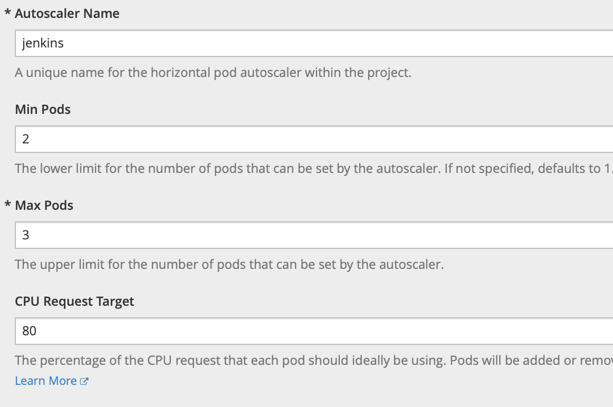

# Lab - 05 Scaling up/down

## Task 1: Create a project

Export the username environment variable. This to be sure that you are going to
create the correct objects.

```
export USERNAME=<username>
```

For this lab we are going to create fresh project. Use the following command.

```
oc new-project lab-05-${USERNAME}
```

Or, of course, create the `lab-05-${USERNAME}` project through the UI.

## Task 2: Create application

If you deploy an application with Openshift it is very easy to create an
autoscaler. Autoscalers are used when for example the CPU load of a pod is equal
or above 80%. This is a treshold that you can configure in the Openshift web
console.

First create a new application from the catalog. We will choose a simple `Jenkins`
deployment.



Click on the normal `Jenkins (Ephemeral)` app and just click `Next`. Now click `Create` and
`Create Anyway` afterwards click `Close`. You will be able to see in the dashboard
that a new application has been created in the project.


Before you continue with the next steps you will have to wait a little for Jenkins
to get deployed.

Navigate to `Applications` `Pods` and you will see that there is one pod running.
There will be 2 pods, but one will be completed. This was for the build of the
application and is not used anymore.


## Task 3: Add autoscaler

Navigate to `Applications` `Deployments` and click on the `jenkins`
deployment. Navigate to the `Configuration` tab and you will see on the right
side an option `Autoscaling` click on `Add Autoscaler`.



Fill in the parameters for `Min Pods` and `Max Pods`. To be able to see the change
we will put the `Min Pods` on `2` and the `Max Pods` on `3`. The `CPU Request Target`
is going to be `80%`. Obviously you can put either value you want in here. Depending
on the kind of application you are running.



Click `Save` and you will get the message that the horizontal autoscaling for
`jenkins` is successful.

You will notice a warning:

```
Warning: This deployment config does not have any containers with a CPU request 
set. Autoscaling will not work without a CPU request. Edit Resource Requests and 
Limits
```

Click the `Edit Resource Requests and Limits` link and set a CPU limit of `100` 
milicores.  The warning message should now have dissapeared. 

When you navigate to `Applications` `Pods` you will now notice that a second pod
is preparing.This could take a minute. When this is done you will have the `2` 
minimum pods of the `jenkins` instance.


## Task 4: Delete project

Delete your project with the following command.

```
oc delete project lab-05-${USERNAME}
```